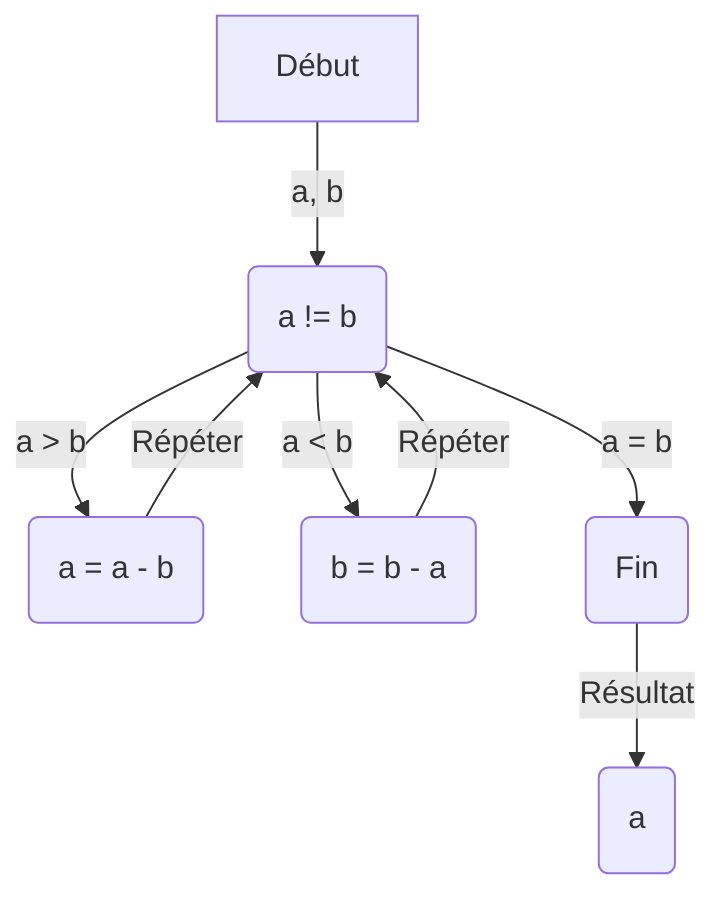

# Introduction

## Qu'est-ce que l'algorithmique?

Ethymologie d'algorithme:

- Al-Khwarizmi, mathématicien perse du IXe siècle,
- Algoritmi de numero Indorum, "Algorithmie des nombres indiens"

Méthode générale de résolution d'un problème.

---

## Définition (essai)

Donald Knuth propose cinq propriétés pour définir un algorithme:

- Finitude: l'algorithme doit se terminer après un nombre fini d'étapes.
- Définition: chaque étape doit être définie précisément.
- Entrées: quantités données avant le début de l'algorithme, prises dans un ensemble d'objets spécifiés.
- Sorties: quantités ayant une relation spécifiée avec les entrées.
- Rendement: Opérations suffisament élémentaires pour être réalisées par un humain.

---

## Exemple

Algorithme d'Euclide pour le calcul du PGCD de deux entiers.

$$
\begin{align*}
\text{Entrées: } & a, b \in \mathbb{N} \\
\text{Sortie: } & d = \text{PGCD}(a, b) \\
\text{Début: } & \\
& \text{Tant que } a \neq b \text{ faire:} \\
& \quad \text{Si } a > b \text{ alors:} \\
& \quad \quad a \leftarrow a - b \\
& \quad \text{Sinon:} \\
& \quad \quad b \leftarrow b - a \\
& \text{Fin Tant que} \\
& d \leftarrow a \\
\text{Fin}
\end{align*}
$$

---

## Définition

Spécification précise et non ambigüe d'une séquence d'opérations à effectuer pour résoudre un problème.

Exprimé dans un langage formel $\rightarrow$ **programme**.

Peut être exécuté par un ordinateur.

---

## Algorithmique

Étude des algorithmes

Analyse d'un algorithme:

- Adapté au problème?
- Efficace?
- Performant?

- Types d'algorithmes:
  - déterministes: même entrée $\rightarrow$ même sortie
  - non-déterministes: comportement aléatoire

---

## Complexité

- Temps d'exécution
- Espace mémoire

<v-click>

### Exemple

Programme qui joue aux échecs avec recherche exhaustive de toutes les possibilités:

</v-click>

<v-clicks>

- $\sim 10^{19}$ configurations.
- $1 \mu s$ / config. $\rightarrow \sim 300$ ans.

</v-clicks>

---

## Paradigmes

- Programmation impérative (procédurale)
- Programmation fonctionnelle
- Programmation orientée objet
- Programmation logique

---

## Programmation impérative

- Écriture d'un programme comme une suite d'instructions à exécuter.
- État du programme modifié par les instructions.
- Exemple: C, C++, Java, Python, JavaScript, PHP, ...

### Exemple

$$\mathrm{somme}(n) = \sum_{i=1}^n i$$

1. Initialisation de la variable $s$ à 0.
2. Pour $i$ allant de $1$ à $n$ faire:
   1. $s \leftarrow s + i$
3. Afficher $s$.

---

## Programmation fonctionnelle

- Écriture d'un programme comme une suite de fonctions.
- Pas de notion d'état.
- Exemple: Haskell, OCaml, Lisp, ...

### Exemple

$$\mathrm{somme}(n) = \sum_{i=1}^n i$$

$
\mathrm{somme}(n) =
\begin{cases}
0 & \text{si } n = 0 \\
n + \mathrm{somme}(n - 1) & \text{sinon}
\end{cases}
$

---

## Architecture de von Neumann

Commune à la plupart des ordinateurs actuels.

principaux composants:

- Unité arithmétique et logique (ALU): opérations élémentaires.
- Unité de contrôle: séquence d'instructions.
- Mémoire: instructions et données.
- Entrées / sorties.

**bottleneck de von Neumann**: un seul bus de données entre l'ALU et la mémoire $\rightarrow$ oblige le CPU à attendre.

---

## Comment est exécuté un programme?

- Compilation: traduction du code source en code machine.
- Interprétation: exécution du code source par un interpréteur.

---

## Compilation

Le code source est traduit en code machine par un compilateur.

Chaque machine a son propre langage machine:

- x86, ARM, MIPS, PowerPC, SPARC, ...

Avantages:

- exécution rapide
- optimisations possibles

Exemples:

<v-click>

- C, C++, Rust, Go, Java, ...

</v-click>

---

## Interprétation

Un interpréteur exécute directement le code source.

Exécute les programmes séquentiellement dans un environnement virtuel.

Avantages:

- portable
- rapide à développer

Inconvénients:

- lent
- détections d'erreurs à l'exécution

Exemples:

<v-click>

- Python, JavaScript, PHP, Ruby, ...

</v-click>
